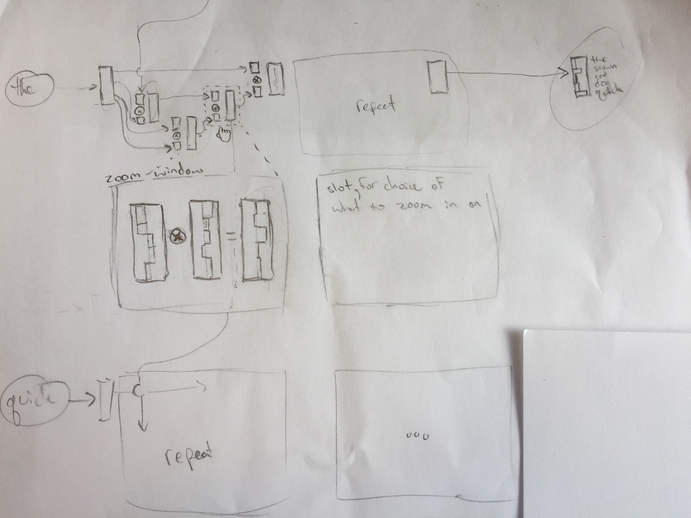

### Neural Network Weight Debugger (nn-wd) Visualization Tool
Tool to debug neural networks, specifically as their weights flow through the computational graph.

#### Sketch

### Development
Requirements:

    # Python 3
    python3 -m venv p3
    source ./p3/bin/activate
    # Libraries (pip based)
    pip install numpy
    pip install tensorflow==1.9.0
    # Libraries (custom)
    curl -LO https://github.com/sawatzkylindsey/pytils/archive/master.zip
    cd pytils-master/
    make install

Running:

    python dev-server.py -v

